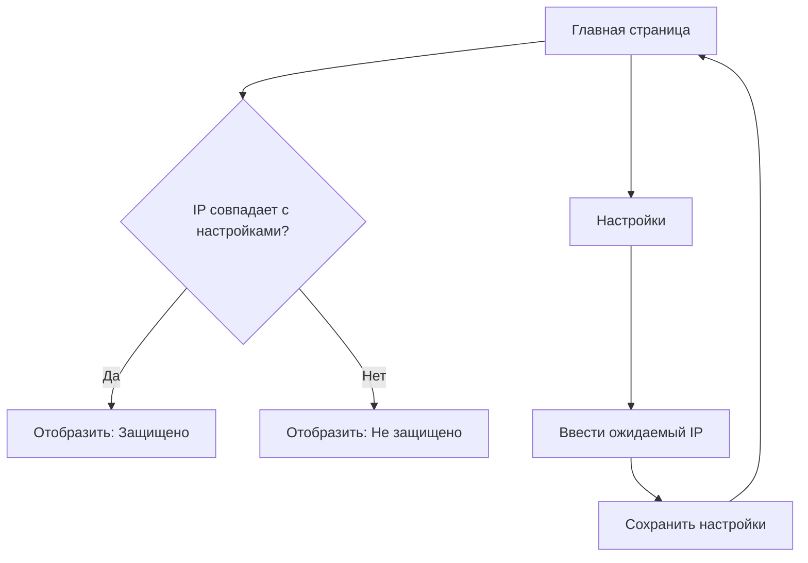

## 1. Обзор продукта
Whier - это веб-сервис для отображения публичного IP-адреса пользователя с дополнительной проверкой подключения к VPN через протокол Hysteria2. Помогает пользователям быстро проверить свой IP-адрес и убедиться в безопасности соединения.

Целевая аудитория - пользователи, ценящие приватность и безопасность в интернете, особенно те, кто использует Hysteria2 VPN для защиты своего соединения.

## 2. Основные функции

### 2.1 Пользовательские роли
Роли не требуются - сервис является публичным и не требует регистрации.

### 2.2 Модуль функций
Основные страницы проекта Whier:
1. **Главная страница**: отображение IP-адреса, индикатор статуса VPN, настройки проверки.
2. **Страница настроек**: конфигурация ожидаемого IP-адреса VPN, настройки порта прокси.

### 2.3 Детали страниц

| Название страницы | Название модуля | Описание функции |
|-------------------|-----------------|------------------|
| Главная страница | Блок отображения IP | Показывать текущий публичный IP-адрес пользователя крупным шрифтом с возможностью копирования |
| Главная страница | Индикатор VPN | Отображать визуальный статус подключения (защищено/не защищено) на основе сравнения текущего IP с настроенным ожидаемым IP |
| Главная страница | Информационная панель | Показывать дополнительную информацию: локация, провайдер, тип соединения |
| Главная страница | Кнопки действий | Кнопка обновления IP, кнопка перехода к настройкам, кнопка копирования IP |
| Страница настроек | Поле ожидаемого IP | Текстовое поле для ввода IP-адреса Hysteria2 сервера для проверки подключения |
| Страница настроек | Настройка порта | Поле для указания локального порта SOCKS5/HTTP прокси (опционально) |
| Страница настроек | Сохранение настроек | Кнопка сохранения конфигурации с локальным хранением в localStorage |

## 3. Основные процессы

### Процесс проверки IP и VPN:
1. Пользователь заходит на главную страницу
2. Система автоматически определяет публичный IP-адрес
3. Сравнивает текущий IP с сохраненным ожидаемым IP из настроек
4. Отображает результат: если IP совпадает - "Защищено через Hysteria2", если нет - "Не защищено"
5. Пользователь может обновить проверку вручную

### Процесс настройки:
1. Пользователь переходит в настройки
2. Вводит IP-адрес своего Hysteria2 сервера
3. При необходимости указывает порт локального прокси
4. Сохраняет настройки
5. Возвращается на главную для проверки

## 4. Пользовательский интерфейс

### 4.1 Стиль дизайна
- Основные цвета: темный фон (#0a0a0a), акцентный зеленый (#00ff88), предупреждающий красный (#ff4444)
- Стиль кнопок: скругленные, с подсветкой при наведении
- Шрифт: Inter, основной размер 16px, заголовки 24-32px
- Стиль компоновки: карточки на темном фоне, минималистичный дизайн
- Иконки: линейные иконки из Heroicons или аналогичного набора

### 4.2 Обзор дизайна страниц

| Название страницы | Название модуля | UI элементы |
|-------------------|-----------------|-------------|
| Главная страница | Блок IP | Центрированная карточка, крупный шрифт 48px, моноширинный шрифт для IP, кнопка копирования справа |
| Главная страница | Индикатор VPN | Световой индикатор (зеленый/красный), текстовый статус, плавная анимация переключения |
| Главная страница | Инфо панель | Мелкий текст серого цвета, иконки перед каждым элементом, grid-раскладка |
| Страница настроек | Форма настройки | Чистые белые поля ввода на темном фоне, подписи светло-серые, кнопка сохранения зеленая |

### 4.3 Адаптивность
Десктоп-first подход с адаптацией для мобильных устройств. Основная версия для компьютеров, оптимизированная под широкие экраны. Мобильная версия с перестроением элементов в вертикальную колонку.