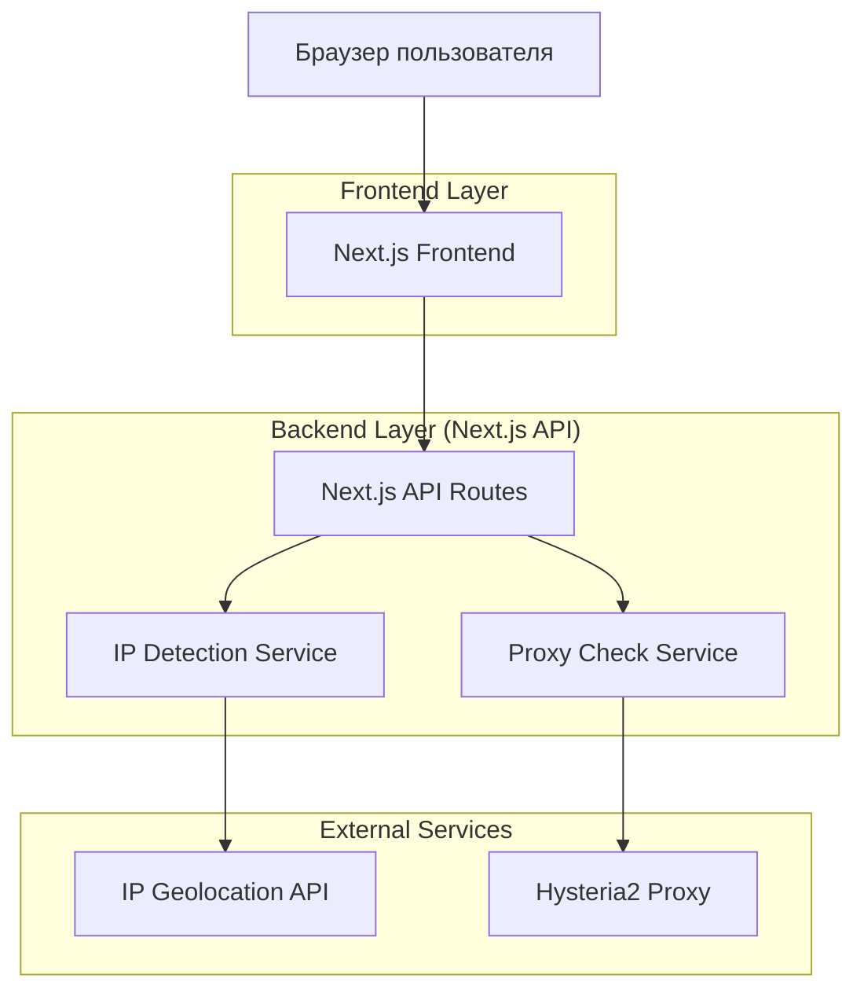
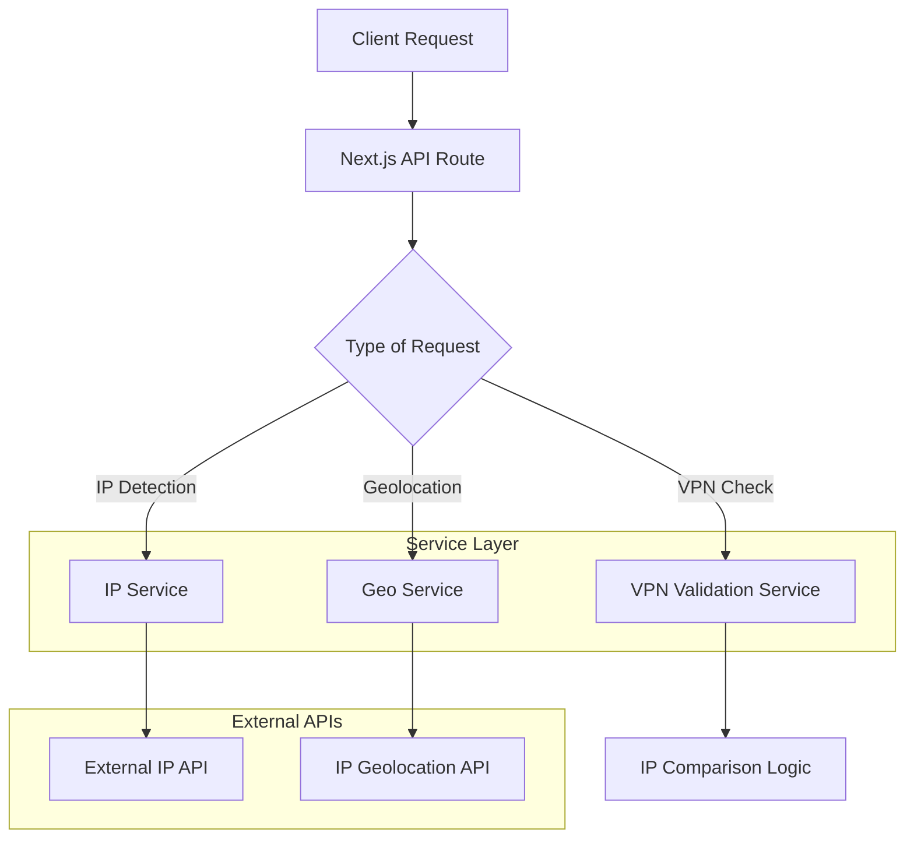

## 1. Архитектура проекта



## 2. Технологический стек

- Frontend: Next.js 14 + React 18 + TypeScript
- Стили: Tailwind CSS 3
- Инициализация: create-next-app
- Backend: Next.js API Routes (встроенные)
- Сторонние библиотеки:
  - axios - для HTTP запросов
  - lucide-react - для иконок
  - @heroicons/react - альтернативный набор иконок

## 3. Определение маршрутов

| Маршрут | Назначение |
|---------|------------|
| / | Главная страница с отображением IP и статусом VPN |
| /settings | Страница настроек для конфигурации ожидаемого IP и порта |
| /api/ip | API endpoint для получения публичного IP-адреса |
| /api/check-vpn | API endpoint для проверки подключения через VPN |
| /api/geolocation | API endpoint для получения информации о локации IP |

## 4. API определения

### 4.1 Получение IP-адреса
```
GET /api/ip
```

Response:
```json
{
  "ip": "192.168.1.1",
  "timestamp": "2026-01-19T12:00:00Z"
}
```

### 4.2 Проверка VPN подключения
```
POST /api/check-vpn
```

Request:
```json
{
  "expectedIp": "10.0.0.1",
  "currentIp": "192.168.1.1"
}
```

Response:
```json
{
  "isVpnConnected": false,
  "message": "IP не совпадает с ожидаемым"
}
```

### 4.3 Получение геолокации
```
GET /api/geolocation?ip=192.168.1.1
```

Response:
```json
{
  "country": "Russia",
  "city": "Moscow",
  "isp": "ISP Name",
  "timezone": "Europe/Moscow"
}
```

## 5. Архитектура серверной части



## 6. Логика проверки Hysteria2

### 6.1 Алгоритм основной проверки
```typescript
interface VpnCheckParams {
  expectedIp: string;
  currentIp: string;
  proxyPort?: number;
}

interface VpnCheckResult {
  isVpnConnected: boolean;
  confidence: 'high' | 'medium' | 'low';
  message: string;
  details: {
    ipMatch: boolean;
    proxyAvailable?: boolean;
  };
}
```

### 6.2 Проверка через прокси (опционально)
```typescript
async function checkProxyConnectivity(port: number): Promise<boolean> {
  try {
    // Проверка SOCKS5 или HTTP прокси на указанном порту
    const response = await fetch(`http://localhost:${port}/test`);
    return response.ok;
  } catch {
    return false;
  }
}
```

## 7. Локальное хранение данных

### 7.1 Структура localStorage
```typescript
interface UserSettings {
  expectedVpnIp: string;
  proxyPort?: number;
  lastCheck: string;
  autoCheck: boolean;
}
```

### 7.2 Ключи localStorage
- `whier_settings` - основные настройки пользователя
- `whier_last_ip` - последний проверенный IP
- `whier_check_history` - история проверок (последние 10)

## 8. Компонентная структура React

### 8.1 Основные компоненты
- `IpDisplay` - отображение IP-адреса
- `VpnStatusIndicator` - индикатор статуса VPN
- `SettingsForm` - форма настроек
- `GeoInfo` - блок с геолокацией
- `CopyButton` - кнопка копирования

### 8.2 Утилиты
- `ipService` - сервис для работы с IP-адресами
- `vpnCheckService` - сервис проверки VPN
- `storageService` - работа с localStorage
- `apiClient` - HTTP клиент для API запросов

## 9. Деплоймент и инфраструктура

### 9.1 Docker и Docker Compose
Приложение полностью контейнеризировано и использует Docker Compose как основной метод сборки и развертывания.

**Docker контейнеризация:**
- Frontend: Next.js приложение упаковано в Docker образ
- Production-optimized: многоэтапная сборка для минимизации размера образа
- Environment variables: конфигурация через переменные окружения
- Volume mapping: для development-режима с hot-reload

**Docker Compose стек:**
```yaml
services:
  whier-app:
    build: .
    ports:
      - "3000:3000"
    environment:
      - NODE_ENV=production
      - NEXT_PUBLIC_API_URL=http://localhost:3000
    restart: unless-stopped
```

### 9.2 Сборка и запуск
**Development режим:**
```bash
docker-compose up -d
```

**Production сборка:**
```bash
docker-compose -f docker-compose.prod.yml up -d
```

### 9.3 Преимущества Docker подхода
- Консистентность окружения: одинаковая работа на локальной машине и продакшене
- Изоляция зависимостей: нет конфликтов между версиями пакетов
- Масштабируемость: легкое масштабирование через docker-compose scale
- Простота деплоя: единая команда для сборки и запуска всего приложения